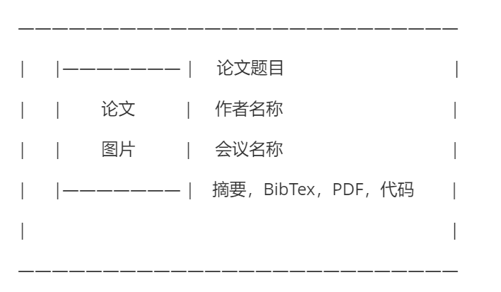

# README

[](https://github.com/yaoyao-liu/minimal-light/blob/main/LICENSE)

\[[在线演示](https://yu-xinda.github.io/yu-xinda/)\] 

*这个项目的源代包含的源代码. 基于 GitHub 官方主题之一 [minimal](https://github.com/orderedlist/minimal) 创建以及在该项目的基础上进行修改和客制化*
<br>
*如果您喜欢这个项目，欢迎您使用和分享*

如果你想对该项目模板样式进行更改，更多信息请参考该仓库

## 使用指南
### 在GitHub上使用

只要在你的项目中添加如下内容的`_config.yml`文件，GitHub Pages 服务就会使用该主题部署网页:

```yaml
remote_theme: yaoyao-liu/minimal-light
```
请注意：添加上述内容到你的项目，会直接应用这个仓库的所有的默认设置。

如果你希望编辑任何文件（例如：`index.md`)，你仍需要把该文件拷贝到你的项目中。

你也可以直接 fork 这个仓库(或者[使用这个仓库作为模板](https://docs.github.com/cn/github/creating-cloning-and-archiving-repositories/creating-a-repository-from-a-template))，然后把名字改为`your-username.github.io`.

然后，你可以根据[这里的说明](https://docs.github.com/cn/pages/getting-started-with-github-pages/creating-a-github-pages-site#creating-your-site)开启这个仓库的GitHub Pages服务。

## 自定义内容

### 编辑主页

主页的html代码存储在_layouts/homepage.html

#### 信息栏

本模板有以下的变量, 你可以在`_config.yml`文件中修改:

```yaml
# 基本信息
title: 你的名字
email: yourname@example.edu
university: 当前所在学校
position: 当前所在地区
experience: 过往经历

# 图片路径
avatar: ./assets/img/avatar.png
favicon: ./assets/img/favicon.png
favicon_dark: ./assets/img/favicon-dark.png
```

#### index.md

index.md用于呈现主页内容，其中分为三大板块内容，introduction、publications、news，具体内容可以在_includes文件夹下在板块对应的md文档中修改相应内容。

#### _includes/introducation.md

可在_includes/introducation.md中更改个人介绍

#### _includes/publictions.md

可在_includes/publictions.md中添加发表的论文信息，添加的信息格式为作者，论文名称，会议名称，年份。建议publications中只呈现4-5篇最新的论文，其余内容可以通过more跳转到新页面详细了解

#### _includes/news.md

可在_includes/news.md中添加个人最新动态，建议news中只呈现3-5条最新消息，其余内容可以通过more跳转到新页面详细了解

### 编辑news/publication详情页

#### news.html

可在news.html中直接编辑news的详情页内容

#### publication.html

可在publication.html中查看publication的详情页，publication的呈现格式固定，为




每块内容修改需要在_data/publication.yaml中修改

## 许可证

这个项目使用 [Creative Commons Zero v1.0 Universal](https://github.com/yaoyao-liu/minimal-light/blob/master/LICENSE) 许可证.

## 致谢

我们的项目用到了以下项目的源代码:

* [pages-themes/minimal](https://github.com/pages-themes/minimal)
* [orderedlist/minimal](https://github.com/orderedlist/minimal)
* [al-folio](https://github.com/alshedivat/al-folio)
* 
