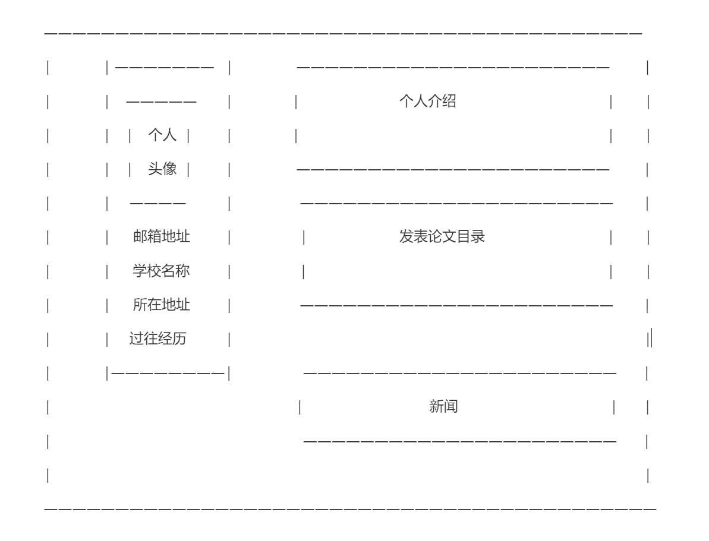

# README

余欣达的个人网页

欢迎访问我的GitHub Pages 个人网站项目 \[[在线演示](https://yu-xinda.github.io/)\] 

*这个项目的源代包含的源代码. 基于 GitHub 官方主题之一 [minimal](https://github.com/orderedlist/minimal) 创建以及在该项目的基础上进行修改和客制化*
<br>
*如果您喜欢这个项目，欢迎您使用和分享*

如果你想对该项目模板样式进行进一步更改，更多项目细节信息请参考该\[[仓库](https://github.com/yaoyao-liu/minimal-light)\]

## 使用指南
### 在GitHub上使用

可以直接下载本项目，并上传至你自己的仓库

也可以直接 fork 这个仓库(或者[使用这个仓库作为模板](https://docs.github.com/cn/github/creating-cloning-and-archiving-repositories/creating-a-repository-from-a-template))，然后把名字改为`your-username.github.io`.

然后，你可以根据[这里的说明](https://docs.github.com/cn/pages/getting-started-with-github-pages/creating-a-github-pages-site#creating-your-site)开启这个仓库的GitHub Pages服务。


## 自定义内容

### 主页

主页的分布情况如图



主页主要分成个人信息板块（左）和具体信息板块（右）

本项目使用的是Jekyll模板，主页的index.md文件为Jekyll模板的默认主页入口，若不更改板块布局可忽略index.md文档


#### 个人信息板块

若更改主页个人信息板块样式，代码存储在_layouts/homepage.html上，可在homepage上修改对应的样式，包括字体样式，布局，背景图片等

若更改主页个人信息的内容，可修改_config.yml文件中对应的参数

_config.yml文件中可修改部分参数如下：

```yaml
# 基本信息
title: 你的名字
state: 当前状态（如硕士生、博士生）
email: yourname@example.edu
university: 当前所在学校
experience: 过往经历

# 图片路径
avatar: ./assets/img/avatar.png #个人头像图片
favicon: ./assets/img/favicon.png #打开页面图标
backgound:  ##用于设置homepage的背景图和About me的背景图（需要手动调节图片大小以适配内容），也可以使用纯色背景（无需调节）。
      site ./assets/img/pexels-samiro-2102367.jpg
```


#### 具体信息板块

具体信息分别为About me（个人介绍板块）、Publication（发表论文目录板块）、News（新闻板块）。

若想修改每个板块的样式以及添加信息，可修改_includes/文件夹下对应的md文件

##### _includes/introducation.md

可在_includes/introducation.md中更改主页中的about me板块信息，其中具体个人信息可通过more跳转到新页面详细了解

##### _includes/publictions.md

可在_includes/publictions.md中添加发表的论文信息，添加的信息格式为作者，论文名称，会议名称，年份。建议publications中只呈现4-5篇最新的论文，其余内容可以通过more跳转到新页面详细了解

##### _includes/news.md

可在_includes/news.md中添加个人最新动态，建议news中只呈现3-5条最新消息，其余内容可以通过more跳转到新页面详细了解


### 分页

分页的具体页面样式、页面文件均存储在对应的文件夹下，三个页面涉及到的文件路径为

```
|- <_data>
|    - pagename.yml #修改页面数据
|- <_pagename>
|    - file #存储页面文件
|	 - image #存储页面图像
|    - pagename.html #修改页面样式
```

如about me的页面涉及的文件路径为

```
|- <_data>
|    - about.yml #修改about页面文本数据
|- <_about>
|    - file #存储页面文件
|	 - image #存储页面图像
|    - about.html #修改about页面样式
```

#### News

可在_news/news.html中可以直接更改news的页面样式，其中news页面内容更改可以通过在 _data/news.yml中增加条目录的方式增加内容

#### About me

可在_about/about.html中直接编辑about me的页面样式，其中about页面内容更改可以通过在 _data/about.yml中增加条目录的方式增加内容

#### Publications

可在_publication/publication.html中查看publication的详情页，publication的呈现格式固定，为


可以在_data/publication.yml中通过增加条目的方式来增加内容

## 许可证

这个项目使用 [Creative Commons Zero v1.0 Universal](https://github.com/yaoyao-liu/minimal-light/blob/master/LICENSE) 许可证.

## 致谢

我们的项目用到了以下项目的源代码:

* [pages-themes/minimal](https://github.com/pages-themes/minimal)
* [orderedlist/minimal](https://github.com/orderedlist/minimal)
* [al-folio](https://github.com/alshedivat/al-folio)
* [yaoyao-liu/minimal-light](https://github.com/yaoyao-liu/minimal-light)
